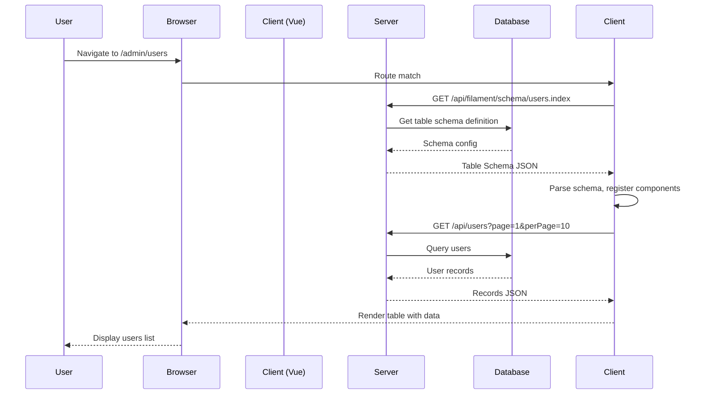
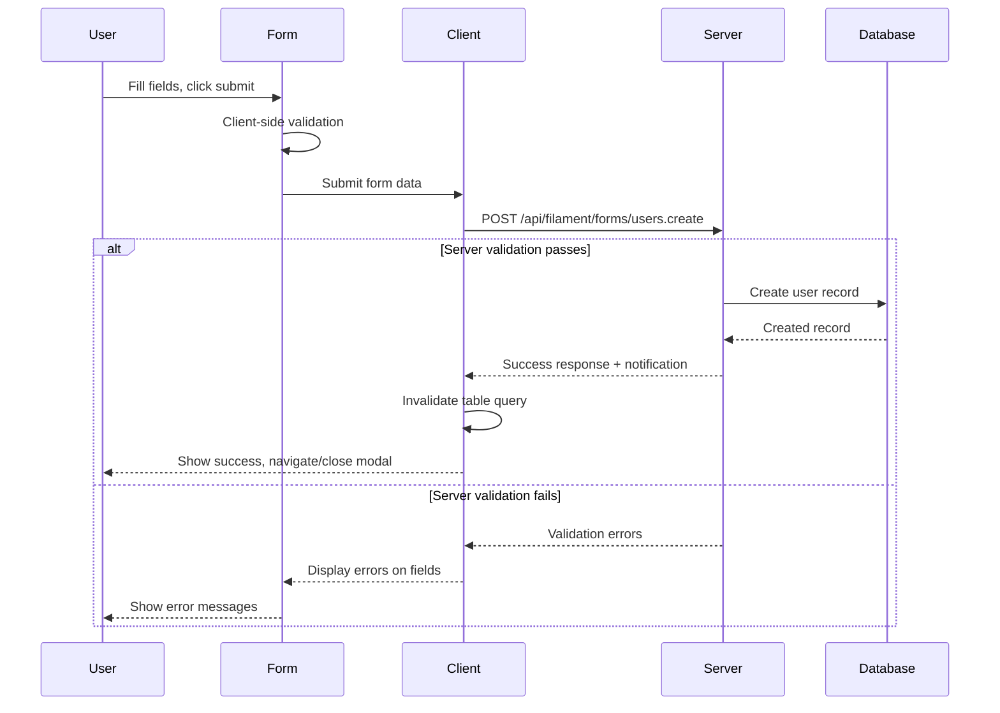
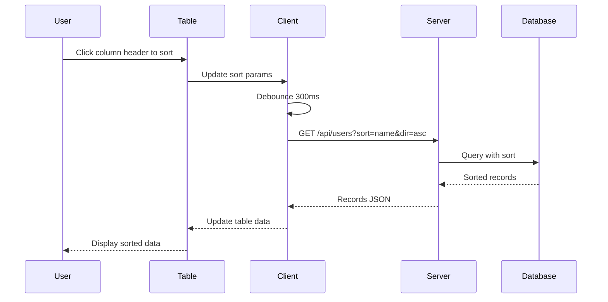
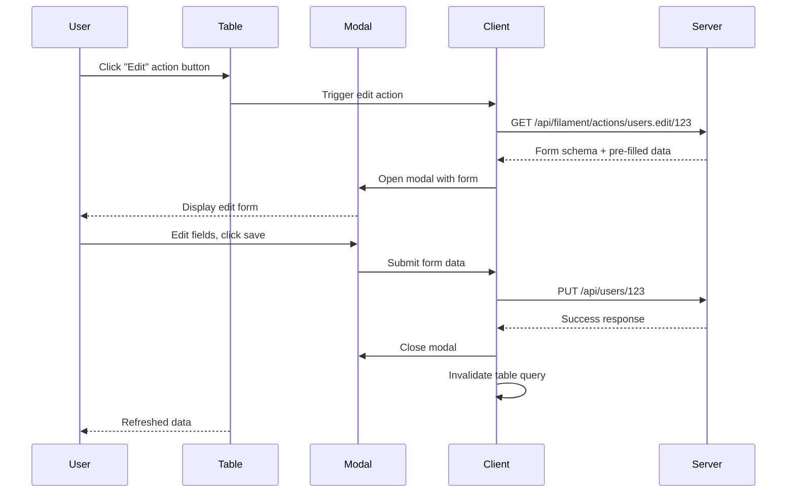

# Milestone 3: Architecture Design

> **Status**: Complete
> **Version**: 1.0.1
> **Date**: 2025-02-10
> **Previous**: Milestone 2 (Technology Stack Research)
> **Next**: Milestone 4 (Development Infrastructure Setup)

---

## Table of Contents

1. [Executive Summary](#executive-summary)
2. [Technology Selection Decisions](#technology-selection-decisions)
3. [Package Architecture](#package-architecture)
4. [SDUI Protocol Specification](#sdui-protocol-specification)
5. [Core Type System](#core-type-system)
6. [Plugin Architecture](#plugin-architecture)
7. [Renderer Strategy](#renderer-strategy)
8. [State Management Architecture](#state-management-architecture)
9. [Sequence Diagrams](#sequence-diagrams)
10. [Open Questions](#open-questions)

---

## 1. Executive Summary

This document defines the system architecture for Filament TypeScript. The architecture is designed around the following core principles:

1. **Declarative API First**: Developers define UIs declaratively, not imperatively
2. **Type Safety End-to-End**: Shared types between server and client
3. **Framework Agnostic**: Core libraries work with any frontend framework
4. **Server-Driven UI**: Server sends schema, client renders
5. **Progressive Enhancement**: Works without JavaScript, enhanced with it
6. **Plugin Extensible**: Every component can be extended or replaced

---

## 2. Technology Selection Decisions

### 2.1 Frontend Framework: Vue 3

**Decision**: Vue 3 with Composition API

**Rationale**:

| Criterion | Score | Notes |
|-----------|-------|-------|
| Laravel DX Alignment | ⭐⭐⭐⭐⭐ | Template syntax closest to Blade (`{{ }}`, `@click`, `v-if`) |
| Framework-Building Proof | ⭐⭐⭐⭐⭐ | Vuetify, Element Plus, PrimeVue prove the patterns |
| Composition API | ⭐⭐⭐⭐⭐ | Ideal for building reusable logic abstractions |
| TypeScript Support | ⭐⭐⭐⭐⭐ | Excellent type inference with Composition API |
| Bundle Size | ⭐⭐⭐ | 34KB runtime (acceptable for admin panels) |
| Ecosystem | ⭐⭐⭐⭐ | Mature, all required libraries available |

**Key Vue 3 Features for Filament**:
- `provide/inject` for theme/config injection
- Teleport for modals/dropdowns
- Suspense for async components
- Built-in transitions
- Directive system for framework extensions

**Alternatives Considered**:
- **Svelte 5**: Better bundle size but less proven for framework-building
- **React 19**: Largest ecosystem but worse DX alignment

### 2.2 Backend Framework: AdonisJS (Primary) with Adapter Pattern

**Decision**: AdonisJS as reference implementation, adapter pattern for others

**Rationale**:

| Criterion | Score | Notes |
|-----------|-------|-------|
| Laravel DX Alignment | ⭐⭐⭐⭐⭐ | "Laravel of Node.js" - Service Providers, Facades, IoC |
| All-in-One | ⭐⭐⭐⭐⭐ | Auth, ORM, validation, migrations included |
| TypeScript First | ⭐⭐⭐⭐⭐ | Designed for TypeScript from day one |
| Performance | ⭐⭐⭐ | Good, not best (acceptable for admin panels) |

**AdonisJS Parallels to Laravel**:

| Laravel | AdonisJS |
|---------|----------|
| Service Providers | Service Providers |
| Facades | Facades |
| Artisan CLI | Ace CLI |
| Eloquent ORM | Lucid ORM |
| Middleware | Middleware |
| Policies | Policies |
| Migrations/Seeders | Migrations/Seeders |

**Adapter Strategy**:
```typescript
// Core adapter interface - any framework can implement
interface ServerAdapter {
  handleRequest(request: Request): Promise<Response>
  authenticate(credentials: Credentials): Promise<User | null>
  authorize(user: User, ability: string, resource: any): boolean
  // ... more methods
}
```

**Supported Backends (Phase 1)**:
1. AdonisJS (reference implementation - `@filament-ts/server-adonis`)
2. NestJS (`@filament-ts/server-nestjs`)
3. Hono/Fastify (generic - `@filament-ts/server-generic`)

### 2.3 ORM Strategy: Adapter Pattern

**Decision**: ORM-agnostic with adapter pattern

**Rationale**: Different teams use different ORMs. Filament should work with any ORM through a common adapter interface.

**Supported ORMs (Phase 1)**:
1. **Drizzle ORM** (`@filament-ts/orm-drizzle`) - Primary recommendation
2. **Prisma** (`@filament-ts/orm-prisma`) - Alternative
3. **Lucid** (`@filament-ts/orm-lucid`) - Built-in for AdonisJS

**ORM Adapter Interface**:
```typescript
interface ORMAdapter<T = any> {
  findMany(model: ModelConfig, query: Query): Promise<T[]>
  findOne(model: ModelConfig, id: string | number): Promise<T | null>
  create(model: ModelConfig, data: Record<string, any>): Promise<T>
  update(model: ModelConfig, id: string | number, data: Record<string, any>): Promise<T>
  delete(model: ModelConfig, id: string | number): Promise<void>
  count(model: ModelConfig, query: Query): Promise<number>
}
```

### 2.4 Build System: Vite + tsup

**Decision**:
- **Vite** for demo/docs/apps (dev server, HMR)
- **tsup** for library packages (dual ESM/CJS output)

**Rationale**:
- Vite: Best DX, instant HMR, native TypeScript
- tsup: Zero-config esbuild wrapper, proper tree-shaking

### 2.5 Monorepo: pnpm + Turborepo

**Decision**: pnpm for package management, Turborepo for task orchestration

**Rationale**:
- pnpm: 50% disk savings, fastest installs
- Turborepo: Intelligent caching, parallel execution, CI optimization

### 2.6 Testing: Vitest + Playwright

**Decision**:
- **Vitest** for unit/component tests
- **Playwright** for E2E tests
- **@testing-library** variants for component testing

### 2.7 Styling: Tailwind CSS v4

**Decision**: Tailwind CSS v4 with custom `.fi-*` semantic classes

**Rationale**:
- Consistency with Filament PHP
- JIT enables server-driven dynamic styles
- ~3KB final CSS output

### 2.8 State Management: Hybrid

**Decision**: Hybrid approach
- **TanStack Query** for server state
- **Pinia** for client UI state
- **Vue Computed** for fine-grained reactivity

### 2.9 Technology Stack Summary

| Category | Selection | Version Target |
|----------|-----------|----------------|
| Frontend Framework | Vue 3 | ^3.5 |
| Build System (Dev) | Vite | ^6.0 |
| Build System (Libs) | tsup | ^8.0 |
| Monorepo | pnpm + Turborepo | ^9.0 + ^2.0 |
| Runtime Target | Node.js | 22+ LTS |
| Backend (Reference) | AdonisJS | ^6.0 |
| ORM (Primary) | Drizzle | ^0.35 |
| Testing | Vitest + Playwright | ^2.0 + ^1.5 |
| Styling | Tailwind CSS | v4 |
| Server State | TanStack Query | ^5.0 |
| Client State | Pinia | ^2.2 |
| Version Management | Changesets | ^2.27 |

---

## 3. Package Architecture

### 3.1 Package Dependency Graph

```
┌─────────────────────────────────────────────────────────────────────┐
│                         APPLICATION LAYER                           │
│  ┌──────────────┐  ┌──────────────┐  ┌──────────────┐              │
│  │    demo-app  │  │  docs-site   │  │ example-apps │              │
│  └──────┬───────┘  └──────┬───────┘  └──────┬───────┘              │
└─────────┼──────────────────┼──────────────────┼─────────────────────┘
          │                  │                  │
┌─────────┼──────────────────┼──────────────────┼─────────────────────┐
│         ▼                  ▼                  ▼                     │
│  ┌─────────────────────────────────────────────────────┐            │
│  │              @filament-ts/panels                    │            │
│  │  (Panel configuration, routing, navigation, auth)  │            │
│  └──────────────────────┬──────────────────────────────┘            │
│                         │                                            │
│  ┌──────────────────────▼──────────────────────────────┐            │
│  │              @filament-ts/resources                  │            │
│  │     (Resource definitions, CRUD orchestration)     │            │
│  └─────┬─────────┬─────────┬─────────┬─────────┬───────┘            │
│        │         │         │         │         │                     │
│  ┌─────▼────┐ ┌─▼──────┐ ┌▼──────┐ ┌▼──────┐ ┌▼────────┐          │
│  │ @filament│ │@filament│ │@fila  │ │@fila  │ │@filament│          │
│  │ -ts/forms│ │-ts/tables│ │-ts/in-│ │-ts/ac-│ │-ts/wid-│          │
│  │          │ │         │ │folists│ │tions  │ │gets    │          │
│  └─────┬────┘ └─┬──────┘ └┬──────┘ └┬──────┘ └┬────────┘          │
│        │        │         │         │         │                     │
│  ┌─────▼────────▼─────────▼─────────▼─────────▼─────────┐         │
│  │              @filament-ts/notifications               │         │
│  └──────────────────────────┬────────────────────────────┘         │
│                             │                                      │
│  ┌──────────────────────────▼────────────────────────────┐        │
│  │                    @filament-ts/ui                     │        │
│  │          (Headless UI components - Vue)               │        │
│  └──────────────────────────┬────────────────────────────┘        │
│                             │                                      │
│  ┌──────────────────────────▼────────────────────────────┐        │
│  │                  @filament-ts/schemas                  │        │
│  │     (Base schema classes, serialization layer)        │        │
│  └──────────────────────────┬────────────────────────────┘        │
│                             │                                      │
│  ┌──────────────────────────▼────────────────────────────┐        │
│  │                  @filament-ts/support                  │        │
│  │      (Utilities, type helpers, common patterns)       │        │
│  └───────────────────────────────────────────────────────┘        │
│                                                                     │
│  ┌─────────────────────────────────────────────────────┐          │
│  │              SERVER ADAPTERS (Optional)              │          │
│  │  @filament-ts/server-adonis  @filament-ts/server-...│          │
│  │  @filament-ts/orm-drizzle    @filament-ts/orm-...   │          │
│  └─────────────────────────────────────────────────────┘          │
│                                                                     │
│  ┌─────────────────────────────────────────────────────┐          │
│  │              TOOLING (Development Only)              │          │
│  │  @filament-ts/cli   @filament-ts/testing             │          │
│  └─────────────────────────────────────────────────────┘          │
└─────────────────────────────────────────────────────────────────────┘
```

### 3.2 Package Descriptions

#### Core Packages (Required)

| Package | Purpose | Dependencies |
|---------|---------|--------------|
| `@filament-ts/support` | Utility functions, type helpers, common patterns | None |
| `@filament-ts/schemas` | Base schema classes, JSON serialization | `support` |
| `@filament-ts/ui` | Headless UI components (Modal, Dropdown, etc.) | `schemas`, Vue 3 |
| `@filament-ts/forms` | Form fields, validation, layout | `schemas`, `ui` |
| `@filament-ts/tables` | Table columns, filters, sorting, pagination | `schemas`, `ui` |
| `@filament-ts/infolists` | Read-only data display entries | `schemas`, `ui` |
| `@filament-ts/actions` | Action framework (modal, slide-over, etc.) | `schemas`, `ui` |
| `@filament-ts/widgets` | Dashboard widgets (stats, charts) | `schemas`, `ui` |
| `@filament-ts/notifications` | Flash notifications, database notifications | `schemas`, `ui` |
| `@filament-ts/resources` | Resource definitions, CRUD orchestration | `forms`, `tables`, `infolists`, `actions` |
| `@filament-ts/panels` | Panel configuration, routing, navigation, auth | `resources`, `notifications` |

#### Server Adapters (Optional)

| Package | Purpose |
|---------|---------|
| `@filament-ts/server-adonis` | AdonisJS adapter (reference implementation) |
| `@filament-ts/server-nestjs` | NestJS adapter |
| `@filament-ts/server-generic` | Generic Express/Hono/Fastify adapter |
| `@filament-ts/orm-drizzle` | Drizzle ORM adapter |
| `@filament-ts/orm-prisma` | Prisma ORM adapter |
| `@filament-ts/orm-lucid` | Lucid ORM adapter (built-in for AdonisJS) |

#### Tooling (Development Only)

| Package | Purpose |
|---------|---------|
| `@filament-ts/cli` | Code generation commands |
| `@filament-ts/testing` | Testing utilities and helpers |

### 3.3 Package Naming Convention

```
@filament-ts/<name>

Where <name> is:
- support, schemas, ui, forms, tables, infolists, actions, widgets, notifications, resources, panels
- server-<framework> (server-adonis, server-nestjs, etc.)
- orm-<orm> (orm-drizzle, orm-prisma, etc.)
- cli, testing
```

### 3.4 Import Path Convention

```typescript
// Public API - import from package root
import { TextField } from '@filament-ts/forms'
import { TextColumn } from '@filament-ts/tables'

// Private/internal - NOT exported, may break
import { InternalThing } from '@filament-ts/forms/internal'
```

---

## 4. SDUI Protocol Specification

### 4.1 Overview

The SDUI (Server-Driven UI) protocol defines how the server and client communicate. The server sends **schema objects** (JSON) that describe UI structure, and the client renders them.

### 4.2 Core Schema Structure

All schema objects follow this base structure:

```typescript
// Base schema interface
interface Schema {
  type: string           // Component type identifier
  id?: string            // Optional unique identifier
  props?: Record<string, any>  // Component-specific properties
  children?: Schema[]    // Nested schemas
  meta?: SchemaMeta      // Metadata for rendering
}

interface SchemaMeta {
  label?: string
  description?: string
  hidden?: boolean
  visible?: boolean
  order?: number
  [key: string]: any
}
```

### 4.3 Form Schema Example

```json
{
  "type": "form",
  "props": {
    "method": "POST",
    "action": "/api/users",
    "statePath": "users.create"
  },
  "children": [
    {
      "type": "text-field",
      "id": "name",
      "props": {
        "label": "Name",
        "required": true,
        "placeholder": "Enter name",
        "validation": ["required", "min:3"]
      },
      "meta": {
        "order": 1
      }
    },
    {
      "type": "email-field",
      "id": "email",
      "props": {
        "label": "Email",
        "required": true,
        "unique": true,
        "validation": ["required", "email", "unique:users,email"]
      },
      "meta": {
        "order": 2
      }
    },
    {
      "type": "section",
      "props": {
        "label": "Additional Info"
      },
      "children": [
        {
          "type": "textarea-field",
          "id": "bio",
          "props": {
            "label": "Bio",
            "rows": 3
          },
          "meta": {
            "order": 3
          }
        }
      ]
    }
  ]
}
```

### 4.4 Table Schema Example

```json
{
  "type": "table",
  "props": {
    "statePath": "users.index",
    "recordsRoute": "/api/users",
    "defaultSortColumn": "created_at",
    "defaultSortDirection": "desc"
  },
  "children": [
    {
      "type": "text-column",
      "id": "name",
      "props": {
        "label": "Name",
        "sortable": true,
        "searchable": true
      }
    },
    {
      "type": "text-column",
      "id": "email",
      "props": {
        "label": "Email",
        "sortable": true
      }
    },
    {
      "type": "boolean-column",
      "id": "active",
      "props": {
        "label": "Active",
        "sortable": true
      }
    }
  ],
  "filters": [
    {
      "type": "select-filter",
      "id": "role",
      "props": {
        "label": "Role",
        "options": [
          {"label": "Admin", "value": "admin"},
          {"label": "User", "value": "user"}
        ]
      }
    },
    {
      "type": "ternary-filter",
      "id": "active",
      "props": {
        "label": "Active"
      }
    }
  ],
  "actions": [
    {
      "type": "edit-action",
      "props": {
        "label": "Edit"
      }
    },
    {
      "type": "delete-action",
      "props": {
        "label": "Delete",
        "requiresConfirmation": true
      }
    }
  ]
}
```

### 4.5 Client → Server Messages

```typescript
// Form submission
interface FormSubmitMessage {
  type: 'form.submit'
  statePath: string
  data: Record<string, any>
}

// Table data request
interface TableDataMessage {
  type: 'table.data'
  statePath: string
  page: number
  perPage: number
  sortColumn?: string
  sortDirection?: 'asc' | 'desc'
  filters: Record<string, any>
}

// Action invocation
interface ActionInvokeMessage {
  type: 'action.invoke'
  statePath: string
  actionId: string
  recordId?: string | number
  data?: Record<string, any>
}
```

### 4.6 Server → Client Responses

```typescript
// Success response
interface SuccessResponse {
  status: 'success'
  data: any
  schema?: Schema  // New schema if UI changed
  notification?: Notification
}

// Validation error response
interface ValidationErrorResponse {
  status: 'error'
  errors: Record<string, string[]>  // Field names → error messages
  schema?: Schema  // Schema with error states
}

// Notification
interface Notification {
  type: 'success' | 'error' | 'warning' | 'info'
  title: string
  body?: string
  duration?: number  // Auto-dismiss after ms
  actions?: NotificationAction[]
}
```

### 4.7 Type Sharing Strategy

Types are shared between server and client through:

1. **Shared types package**: `@filament-ts/schemas` exports all core types
2. **Code generation**: CLI generates types from server schema definitions
3. **Runtime type validation**: Zod schemas validate at runtime

```typescript
// Both server and client import the same types
import { FormSchema, TableSchema, ActionSchema } from '@filament-ts/schemas'

// Server: Define schema
const userForm = new FormSchema({
  fields: [/* ... */]
})

// Serialize to JSON for client
const json = userForm.toJSON()

// Client: Parse and use
const parsed = FormSchema.fromJSON(json)
```

### 4.8 Field/Column Type Registry

All field/column types are registered in a global registry:

```typescript
interface TypeRegistry {
  register(type: string, component: ComponentType): void
  get(type: string): ComponentType | undefined
  has(type: string): boolean
}

// Usage
registry.register('text-field', TextField)
registry.register('email-field', EmailField)
registry.register('select-field', SelectField)
// ... etc
```

---

## 5. Core Type System

### 5.1 Fluent API Design: Class-Based with Method Chaining

Filament uses a **class-based fluent API** for defining schemas:

```typescript
// Example: Defining a form
const form = new Form()
  .schema([
    new TextField('name')
      .label('Name')
      .required()
      .placeholder('Enter name')
      .helperText('Enter the full name'),

    new EmailField('email')
      .label('Email')
      .unique()
      .validation(['email', 'max:255']),

    new SelectField('role')
      .label('Role')
      .options([
        { label: 'Admin', value: 'admin' },
        { label: 'User', value: 'user' },
      ])
      .default('user'),
  ])
  .method('POST')
  .action('/api/users')
```

### 5.2 Base Schema Classes

```typescript
// Base class for all schema components
abstract class SchemaComponent {
  readonly id: string
  readonly type: string
  protected props: Map<string, any> = new Map()
  protected meta: Map<string, any> = new Map()

  // Fluent setters return this for chaining
  label(label: string): this {
    this.props.set('label', label)
    return this
  }

  hidden(hidden: boolean = true): this {
    this.meta.set('hidden', hidden)
    return this
  }

  // Serialization
  toJSON(): Schema {
    return {
      type: this.type,
      id: this.id,
      props: Object.fromEntries(this.props),
      meta: Object.fromEntries(this.meta),
    }
  }

  static fromJSON(json: Schema): SchemaComponent {
    // Factory method to deserialize
  }
}

// Base field class
abstract class Field extends SchemaComponent {
  readonly id: string
  readonly type: string

  protected constructor(id: string, type: string) {
    super()
    this.id = id
    this.type = type
  }

  // Common field methods
  required(required: boolean = true): this { /* ... */ }
  default(value: any): this { /* ... */ }
  placeholder(text: string): this { /* ... */ }
  helperText(text: string): this { /* ... */ }
  validation(rules: ValidationRule[]): this { /* ... */ }
}

// Concrete field implementations
class TextField extends Field {
  constructor(id: string) {
    super(id, 'text-field')
  }

  minLength(length: number): this { /* ... */ }
  maxLength(length: number): this { /* ... */ }
}

class EmailField extends Field {
  constructor(id: string) {
    super(id, 'email-field')
  }
}

class SelectField extends Field {
  constructor(id: string) {
    super(id, 'select-field')
  }

  options(opts: SelectOption[]): this {
    this.props.set('options', opts)
    return this
  }

  searchable(searchable: boolean = true): this { /* ... */ }
  multiple(multiple: boolean = true): this { /* ... */ }
}
```

### 5.3 Type Inference Patterns

Using TypeScript generics to infer field types from schema:

```typescript
// Infer data type from schema
type InferSchemaData<T extends Schema> = T extends Field
  ? { [K in T['id']]: FieldValueType<T> }
  : never

// Example
const userForm = new Form()
  .schema([
    new TextField('name'),
    new NumberField('age'),
    new BooleanField('active'),
  ])

// Inferred type: { name: string; age: number; active: boolean }
type UserData = InferFormData<typeof userForm>
```

### 5.4 Validation Rule Types

```typescript
type ValidationRule =
  | 'required'
  | 'email'
  | 'url'
  | 'numeric'
  | 'integer'
  | { min: number }
  | { max: number }
  | { minLength: number }
  | { maxLength: number }
  | { regex: string }
  | { in: readonly any[] }
  | { unique: string }
  | { custom: (value: any) => boolean | string }
```

---

## 6. Plugin Architecture

### 6.1 Plugin Registration

```typescript
// Plugin interface
interface FilamentPlugin {
  name: string
  version: string

  // Lifecycle hooks
  boot(app: FilamentApp): void | Promise<void>
  register(): void | Promise<void>

  // Extension points
  registerFields?(registry: FieldRegistry): void
  registerColumns?(registry: ColumnRegistry): void
  registerActions?(registry: ActionRegistry): void
  registerWidgets?(registry: WidgetRegistry): void
}

// Registering a plugin
import { FilamentApp } from '@filament-ts/panels'

const app = new FilamentApp({
  plugins: [
    new MyCustomPlugin(),
  ],
})
```

### 6.2 Extending with Custom Fields

```typescript
// Define a custom field
class ColorPickerField extends Field {
  constructor(id: string) {
    super(id, 'color-picker-field')
  }

  // Custom methods
  format(format: 'hex' | 'rgb' | 'hsl'): this {
    this.props.set('format', format)
    return this
  }

  withAlpha(withAlpha: boolean = true): this {
    this.props.set('alpha', withAlpha)
    return this
  }
}

// Register the field
const plugin: FilamentPlugin = {
  name: 'color-picker',
  version: '1.0.0',

  boot(app) {
    // Initialize
  },

  registerFields(registry) {
    registry.register('color-picker-field', ColorPickerField)
  },
}
```

### 6.3 Hook System

```typescript
// Lifecycle hooks
type HookCallback = (...args: any[]) => void | Promise<void> | any

interface HookSystem {
  before(name: string, callback: HookCallback): void
  after(name: string, callback: HookCallback): void
  around(name: string, callback: HookCallback): void
  emit(name: string, ...args: any[]): Promise<any[]>
}

// Usage
hooks.before('form.submit', async (data) => {
  // Modify data before submission
  data.createdAt = new Date()
})

hooks.after('form.submit', async (response) => {
  // Handle response after submission
  if (response.status === 'success') {
    notify('Success!', 'success')
  }
})
```

### 6.4 Theme Customization

```typescript
// Theme configuration
interface ThemeConfig {
  colors: {
    primary: string
    secondary: string
    success: string
    danger: string
    warning: string
    info: string
    gray: Record<string, string>
  }
  borderRadius: string
  fontFamily: {
    sans: string[]
    mono: string[]
  }
  spacing: Record<string, string>
}

// Apply custom theme
const app = new FilamentApp({
  theme: {
    colors: {
      primary: '#3b82f6',
      // ...
    },
  },
})
```

### 6.5 Render Hooks (Fill Slots)

```typescript
// Inject custom content at specific points
interface RenderHooks {
  register(
    component: string,
    position: 'before' | 'after' | 'replace' | 'append' | 'prepend',
    callback: () => VNode | string
  ): void
}

// Usage
renderHooks.register('text-field', 'after', () =>
  h('span', { class: 'ml-2 text-gray-500' }, 'Required')
)

renderHooks.register('table-row', 'before', (props) =>
  h('tr', { class: 'bg-yellow-50' }, props.children)
)
```

---

## 7. Renderer Strategy

### 7.1 Component Registration System

```typescript
// Renderer registry
interface RendererRegistry {
  register(type: string, component: Component): void
  get(type: string): Component | undefined
  render(schema: Schema): VNode
}

// Vue renderer implementation
class VueRenderer implements RendererRegistry {
  private components = new Map<string, Component>()

  register(type: string, component: Component): void {
    this.components.set(type, component)
  }

  get(type: string): Component | undefined {
    return this.components.get(type)
  }

  render(schema: Schema): VNode {
    const component = this.get(schema.type)
    if (!component) {
      console.warn(`Unknown schema type: ${schema.type}`)
      return h('div', `Unknown type: ${schema.type}`)
    }

    return h(component, {
      schema,
      key: schema.id,
    })
  }
}
```

### 7.2 Props Resolution

```typescript
// Props are resolved from schema.props
interface PropsResolver {
  resolve(schema: Schema, context: RenderContext): Record<string, any>
}

// Example resolution
function resolveProps(schema: Schema, context: RenderContext) {
  const base = { ...schema.props }

  // Resolve dynamic values
  for (const [key, value] of Object.entries(base)) {
    if (typeof value === 'function') {
      base[key] = value(context)
    }
  }

  return base
}
```

### 7.3 Recursive Rendering

```typescript
// Schema renderer component (Vue)
const SchemaRenderer = {
  name: 'SchemaRenderer',

  props: {
    schema: {
      type: Object as PropType<Schema>,
      required: true,
    },
  },

  setup(props) {
    const renderer = inject<RendererRegistry>('filament:renderer')

    return () => {
      const { schema } = props

      // Render children recursively
      const children = schema.children?.map(child =>
        h(SchemaRenderer, { schema: child, key: child.id })
      )

      return renderer.render({ ...schema, children })
    }
  },
}
```

### 7.4 Conditional Rendering

```typescript
// Conditional visibility based on schema.meta
function isVisible(schema: Schema, context: RenderContext): boolean {
  const meta = schema.meta || {}

  // Explicit hidden flag
  if (meta.hidden === true) return false

  // Conditional visibility function
  if (meta.visible && typeof meta.visible === 'function') {
    return meta.visible(context)
  }

  return true
}

// Usage in renderer
if (isVisible(schema, context)) {
  return renderer.render(schema)
}
return null
```

### 7.5 Lazy Loading Strategy

```typescript
// Lazy load components for better initial load
function createLazyRenderer(type: string) {
  return defineAsyncComponent(() =>
    import(`./components/${type}.vue`)
  )
}

// Register lazy components
renderer.register('heavy-chart-widget', createLazyRenderer('HeavyChartWidget'))
renderer.register('rich-editor-field', createLazyRenderer('RichEditorField'))
```

---

## 8. State Management Architecture

### 8.1 Hybrid State Architecture

```
┌─────────────────────────────────────────────────────────────────┐
│                        STATE LAYERS                             │
├─────────────────────────────────────────────────────────────────┤
│                                                                 │
│  ┌─────────────────────────────────────────────────────────┐   │
│  │  SERVER STATE (TanStack Query)                          │   │
│  │  - API data fetching & caching                          │   │
│  │  - Form submissions (mutations)                         │   │
│  │  - Table data (list records)                            │   │
│  │  - Resource CRUD operations                            │   │
│  │  - Automatic loading/error states                       │   │
│  └─────────────────────────────────────────────────────────┘   │
│                           │                                     │
│  ┌────────────────────────▼───────────────────────────────┐   │
│  │  CLIENT STATE (Pinia Stores)                           │   │
│  │  - UI state (modal open/close)                         │   │
│  │  - Table UI state (column visibility)                  │   │
│  │  - Notification queue                                  │   │
│  │  - Panel configuration                                 │   │
│  └─────────────────────────────────────────────────────────┘   │
│                           │                                     │
│  ┌────────────────────────▼───────────────────────────────┐   │
│  │  FINE-GRAINED REACTIVITY (Vue Computed/Ref)            │   │
│  │  - Form field changes (high frequency)                 │   │
│  │  - Table filtering/sorting                             │   │
│  │  - Real-time validation feedback                       │   │
│  │  - Derived values from other state                     │   │
│  └─────────────────────────────────────────────────────────┘   │
│                                                                 │
└─────────────────────────────────────────────────────────────────┘
```

### 8.2 Server State (TanStack Query)

```typescript
// Query hooks for server state
import { useQuery, useMutation, useQueryClient } from '@tanstack/vue-query'

// Fetch table data
function useTableData(statePath: string, params: Ref<TableParams>) {
  return useQuery({
    queryKey: ['table', statePath, params],
    queryFn: () => api.get(`/api/filament/schema/${statePath}`, params),
    staleTime: 5000, // 5 seconds
  })
}

// Form submission mutation
function useFormSubmit(statePath: string) {
  const queryClient = useQueryClient()

  return useMutation({
    mutationFn: (data: any) =>
      api.post(`/api/filament/schema/${statePath}`, data),

    onSuccess: (response) => {
      // Invalidate related queries
      queryClient.invalidateQueries({ queryKey: ['table'] })

      // Show notification
      notification.show(response.notification)
    },
  })
}
```

### 8.3 Client State (Pinia)

```typescript
// UI state store
export const useUIStore = defineStore('ui', () => {
  // Modal state
  const modals = ref<Map<string, boolean>>(new Map())

  function openModal(id: string) {
    modals.value.set(id, true)
  }

  function closeModal(id: string) {
    modals.value.set(id, false)
  }

  // Table column visibility
  const columnVisibility = ref<Record<string, Record<string, boolean>>>({})

  function setColumnVisibility(tableId: string, columnId: string, visible: boolean) {
    if (!columnVisibility.value[tableId]) {
      columnVisibility.value[tableId] = {}
    }
    columnVisibility.value[tableId][columnId] = visible
  }

  return {
    modals,
    openModal,
    closeModal,
    columnVisibility,
    setColumnVisibility,
  }
})
```

### 8.4 Form State Flow

```
┌─────────────────────────────────────────────────────────────────┐
│                     FORM STATE FLOW                              │
├─────────────────────────────────────────────────────────────────┤
│                                                                 │
│  1. INITIAL LOAD                                                │
│     Server → Schema JSON → Form renders with defaults           │
│                                                                 │
│  2. USER INPUT                                                  │
│     Field change → Local ref updates → Validation runs          │
│                                  │                               │
│                                  ▼                               │
│     Computed: isValid → Enable/disable submit button            │
│                                                                 │
│  3. SUBMISSION                                                  │
│     Submit clicked → Mutation starts → Send to server           │
│                                  │                               │
│                                  ▼                               │
│     Server validates → Returns success OR validation errors     │
│                                  │                               │
│                    ┌───────────────┴───────────────┐            │
│                    ▼                               ▼            │
│              Success                         Validation Error    │
│         Invalidate queries                  Show errors         │
│         Show notification                   Re-render form      │
│         Navigate/Close modal                                     │
│                                                                 │
└─────────────────────────────────────────────────────────────────┘
```

### 8.5 Table State Flow

```typescript
// Table state store
export const useTableStore = defineStore('table', (statePath: string) => {
  // Server state (fetched via TanStack Query)
  const params = ref<TableParams>({
    page: 1,
    perPage: 10,
    sortColumn: undefined,
    sortDirection: 'asc',
    filters: {},
  })

  // Local UI state (doesn't trigger server fetch)
  const selectedRows = ref<Set<string | number>>(new Set())
  const columnVisibility = ref<Record<string, boolean>>({})

  // Actions
  function setPage(page: number) {
    params.value.page = page
  }

  function setSort(column: string, direction: 'asc' | 'desc') {
    params.value.sortColumn = column
    params.value.sortDirection = direction
    params.value.page = 1 // Reset to first page
  }

  function setFilter(key: string, value: any) {
    params.value.filters[key] = value
    params.value.page = 1 // Reset to first page
  }

  function toggleRow(id: string | number) {
    if (selectedRows.value.has(id)) {
      selectedRows.value.delete(id)
    } else {
      selectedRows.value.add(id)
    }
  }

  return {
    params,
    selectedRows,
    columnVisibility,
    setPage,
    setSort,
    setFilter,
    toggleRow,
  }
})
```

---

## 9. Sequence Diagrams

### 9.1 Initial Page Load Sequence



### 9.2 Form Submission Sequence



### 9.3 Table Filter/Sort Sequence



### 9.4 Action Modal Sequence



---

## 10. Open Questions

The following questions remain open and will be answered during implementation:

| Question | Milestone | Status |
|----------|-----------|--------|
| Real-time strategy (WebSocket vs SSE) | M11 | Pending |
| Chart library selection | M10 | Pending |
| File upload storage abstraction | M13 | Pending |
| Internationalization strategy | M16 | Pending |
| Accessibility testing approach | M15 | Pending |

---

## 11. Next Steps

With architecture design complete, the next milestone is:

**Milestone 4: Development Infrastructure Setup**
- Monorepo configuration (pnpm + Turborepo)
- Build pipeline configuration
- Testing infrastructure setup
- CI/CD pipeline configuration
- Documentation site setup
- Code quality tools

---

## Document Status

- [x] Technology Selection Decisions
- [x] Package Architecture
- [x] SDUI Protocol Specification
- [x] Core Type System
- [x] Plugin Architecture
- [x] Renderer Strategy
- [x] State Management Architecture
- [x] Sequence Diagrams
- [x] Open Questions (documented for later milestones)
